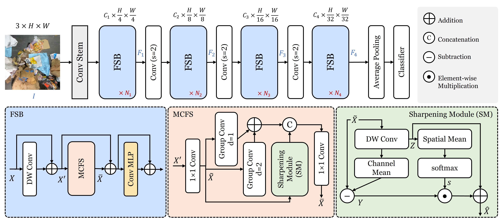
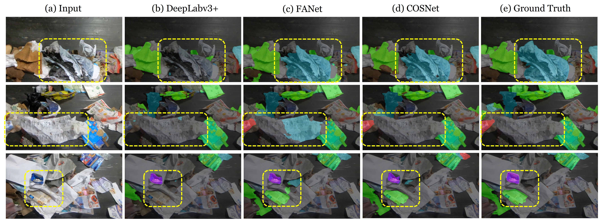
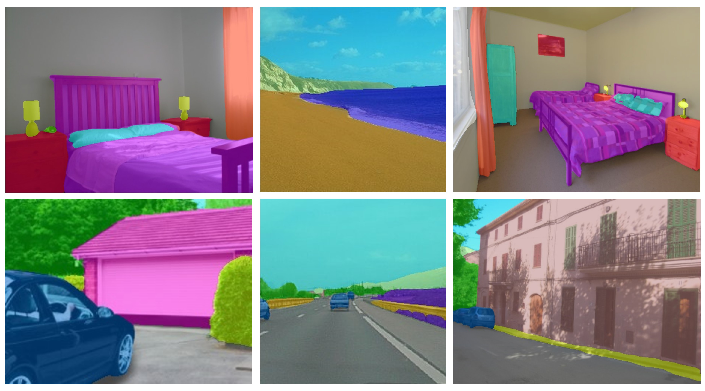

# COSNet: A Novel Semantic Segmentation Network using Enhanced Boundaries in Cluttered Scenes

[[Arxiv]](https://arxiv.org/abs/2410.24139)

- **Code is released !!!**
- **Models weights are uploaded !!!**

## Overview
COSNet uses boundary cues along with multi-contextual information to accurately segment the objects in cluttered scenes. COSNet introduces novel components including feature sharpening block (FSB) and boundary enhancement module (BEM) for enhancing the features and highlighting the boundary information of irregular waste objects in cluttered environment.



------------------------------------------------------------------------------------

## Installation
The codebase is adapted from [[PVT]](https://github.com/whai362/PVT) repository. 
Please follow the instructions available [here](https://github.com/whai362/PVT/tree/v2/segmentation) to install the [mmsegmentation v0.13.0](https://github.com/open-mmlab/mmsegmentation/tree/v0.13.0).

**Requirements**

```
pytorch v1.10.1+cu111
mmsegmentation v0.13.0
mmcv 1.4.0
```

## Training
You can find the datasets here:

[[Zero-Waste-f]](https://github.com/dbash/zerowaste) [[Spectral-Waste]](https://sites.google.com/unizar.es/spectralwaste)

You can utilize the below commands to train the COSNet:

**Zero-Waste-f dataset**
```
CUDA_VISIBLE_DEVICES=1 python train.py configs/cosnet/uper_cosnet_zerowaste_40k.py
```

**Spectral-Waste dataset (RGB only)**
```
CUDA_VISIBLE_DEVICES=1 python train.py configs/cosnet/uper_cosnet_specwaste_40k.py
```

**ADE20k dataset**
```
CUDA_VISIBLE_DEVICES=1 python train.py configs/cosnet/uper_cosnet_ade20k_160k.py
```

## Evaluation
```
# Zero-Waste-f
python test.py configs/cosnet/uper_cosnet_zerowaste_40k.py ./zerowaste_logs/iter_40000.pth --eval mIoU

# Spectral-Waste
python test.py configs/cosnet/uper_cosnet_specwaste_40k.py ./spectralwaste_logs/iter_40000.pth --eval mIoU

# ADE20k
python test.py configs/cosnet/uper_cosnet_ade20k_160k.py ./ade20k_logs/iter_160000.pth --eval mIoU
```

## Results
| Model | Dataset | mIoU (%) |  |
| :--- | :---: | :---: | :---: |
| COSNet | Zero-Waste-f | 56.67 | [download](https://huggingface.co/mubashir04/cosnet_semantic_segmentation) |
| COSNet | Spectral-Waste | 69.96 | [download](https://huggingface.co/mubashir04/cosnet_semantic_segmentation) |
| COSNet | ADE20k | 48.4 | [download](https://huggingface.co/mubashir04/cosnet_semantic_segmentation) |

**Model Weights** are uploaded !!!

Download the pret-training ImageNet1k weights from [here](https://huggingface.co/mubashir04/cosnet_semantic_segmentation)

**Visualizations**

Examples from Zero-Waste-f



Examples from ADE20k



## Citation
```
@misc{ali2024cosnet,
      title={COSNet: A Novel Semantic Segmentation Network using Enhanced Boundaries in Cluttered Scenes}, 
      author={Muhammad Ali and Mamoona Javaid and Mubashir Noman and Mustansar Fiaz and Salman Khan},
      year={2024},
      eprint={2410.24139},
      archivePrefix={arXiv},
      primaryClass={cs.CV},
      url={https://arxiv.org/abs/2410.24139}, 
}
```

## See Also
[FANet](https://github.com/techmn/fanet): Feature Amplification Network for Semantic Segmentation in Cluttered Background
